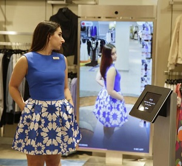

# Marketing Requirements Document (MRD) "Digital Valet"

*Full length mirror with sensors and AI to help make decisions about clothes*

The *Digital Valet* (working title) is an integrated hardware and software solution for personal use, which helps users manage their clothes and help make decisions about what to wear.

 *Prototype*

After a setup process, users would stand in front of the Digital Valet's full length mirror and use the connected interface to have the AI-based system suggest a set of clothing.  Suggestions would be based on:

- Database of clothes the user owns
- What goes with what
- Knowledge of what's been worn recently (to avoid duplication)
- Considerations of the season and current weather
- User input about: type of function coming up (fancy vs. casual ...whatever)

...and other decisions deemed important as determined by user research.

Through an array of sensors, the system can also track clothes that need to be tailored, fixed, or replaced based on various factors, e.g. changes of weight of the user, or wear-and-tear of the clothes.

Other features may include, but not limited to:

- AR display of the system's proposed outfit on the user
- Automatic rendering of purchased clothes (storage in the database for use by AR) based on remote access to online images 
- Semi-automatic cataloging of clothes in the user's closet
- Purchase assistant (Alexa-like) to try and then have new clothes shipped

## Revenue or Cost Focus

The purpose of the Digital Valet is primarily for **revenue generation** because it would be a consumer product that must be purchased by individuals for home use.  

However, the Digital Valet can also be a **cost-saving** product because it enables the user to spend less time making decisions about what to wear, and it may reduce wear-and-tear on clothes by spreading out the number of times an item is worn.

## Desire to Innovate

There are existing "magic mirror" applications in retail that allow users to virtually try-on outfits.  Also, there are small applications (light database apps) for users' tracking and management of clothes (but they're not very popular; generally more trouble than they're worth).  So even though there are models on which we can pattern the Digital Valet, it would require new innovation due to the unique combination of these two products.

Also, the AI decision-making capabilities to sense changes in the user's size and wear-and-tear of clothes would require completely new innovation.

## Length of Time Horizon

Targeting a beta test over the summer, the stakeholders of the Digital Valet have established the summer of 2019 as the target for launch.  

The set-back schedule for the design, development, manufacturing and delivery of the Digital Valet is as follows: 

- Design Process: February through the end of April 2019
- Prototype development and manufacturing: May 2019
- Delivery of the first working set of products: June 2019

### Design Schedule Detail

| Activity                                          | Timeframe                |
| ------------------------------------------------- | ------------------------ |
| Design Research                                   | February 2019            |
| User & Domain Analysis (U&DA) Complete            | February 28, 2019        |
| Development of Requirements and Context Scenarios | March 2019 (first half)  |
| Development of Framework and Design Language      | March 2019 (second half) |
| Form & Behavior Specification (F&BS)              | March 28, 2019           |
| Detailed Design Development                       | April 2019               |
| Delivery of final design and presentation         | Late April 2019          |

## Understanding of the Problem

The Digital Valet opportunity is based on the growing market of white-collar professionals with disposable income, primarily older adults who value their time, and are also concerned about their appearance.  The social implications of how one dresses is a constant concern.  It is supposed to look effortless, however they know that maintaining a wardrobe takes time and considerable effort.  

Furthermore, maintenance mistakes can be costly.  Remembering when to have certain clothes dry cleaned; making sure one does not over-wear one item too many times in a row; all this can lead to items wearing out prematurely, leading to more purchases.

**The challenge will be for the design team** to create simple-enough system that is more easy to use than to try and manage a wardrobe oneself.  The goal of the product is to stop worrying and learn to trust the Digital Valet.

## Willingness to Invest

The Digital Valet product would be a luxury product.  Everyone, short of the super rich, does very well without a real valet to pick and layout their clothes.  But the next best thing, a *digital* valet would be an extravagance that people would want as an indulgence.  Therefore, the design and look & feel, of the Digital Valet product needs to be *high end* to further the illusion of lavishness.  I.e., *no expense spared* should drive the design decisions.

## Risk Factors

Most of the risk in the development of the Digital Valet is on the software development team.  The success of the product depends on the reliability of the AI functionality.  But beyond that, the look & feel of the product, and the simplicity of the workflow when the user engages it is vital to creating an emotional connection between the user and their "personal" valet.  Without the ability of the user to completely trust the Digital Valet, the product would fail.