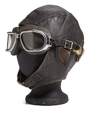

# Marketing Requirements Document (MRD) "Multi Headphones"

*Modular headphones with switchable parts*

*Multi Headphones* (working title) are fashion-focused headphones that will work like a regular, high-end personal listening speaker system, but it will provide considerably more features through a combination of modular addons that extend the capabilities of the product.  The addons will go beyond sound features, providing fashion, aesthetic, comfort, and communication capabilities that will integrate with the base product through a system of interfaces, both physical and digital.

** *Prototype, based on WWII Pilot Gear Other styles will be designed*

The target consumer for the Multi Headphones product will be out-going, fashion-conscientious, millennials  with disposable income who want to make a statement in terms of the intersection between style and functionality.  

In addition to the base headphones, installable options may include:

- Style covers - colors, fabrics, including flashing lights 
- Outward facing text display - for posting of short messages and/or current music selection and/or in-call or free status
- Ear muffs and other cold-weather addons in different shapes, sizes, textures, and colors
- Electronic cooling gear for hot-weather addons (a small Freon circulating unit and fans under a connected hat-like extension)
- Sun-shades for eye-protection (with a prescription option)
- Eyeglass heads-up display
- Audio enhancing features to support conversation in loud environments
- Bluetooth interface for control of options
- Bluetooth interface for smart phone telecommunications (with built-in microphone)

...and more modules based on user research.

In social situations, the combination of the installable options (above) would represent the user's emotional frame of mind through a visual statement, while the user gets the benefit of the technological features.

## Revenue or Cost Focus

The Multi Headphones product will be a new entry into the personal sound-listening market, therefore it's purpose would be strictly revenue generation.  The business goal would be to have consumers stop using their existing headphones and cut-over to the Multi Headphones product, and then begin buying addon modules over time.

According to the market research team, the business model for the Multi Headphone product supports a relatively low cost-of-entry pricing model.  Most revenue would be generated through the purchase of addons that would belong to various categories and allow consumers to pick, mix and match, based on their personal desired feature-set and price constraints.  Pricing models and package pricing to maximize revenue generation are under development by the marketing team.

## Desire to Innovate

The development of the Multi Headphones will use a part-renovate and part-innovate design process.  The extended, modular features will be recognizable to consumers, however their combination into a plug-n-play system will require innovation in the way the parts interact with each other, and the way the user interacts with (or without) the modules.  

The innovation can extend to never-before-seen features such as text display, flashing lights, and party-mode applications.

## Length of Time Horizon

Targeting the summer party scene, the investors of the Multi Headphones have established the summer of 2019 as the target for launch.  

The set-back schedule for the design, development, manufacturing and delivery of the first iteration of the Multi Headphones base product and suite of addons is as follows: 

- Design Process: February through the end of April 2019
- Prototype development and manufacturing: May 2019
- Delivery of the first working set of products: June 2019

### Design Schedule Detail

| Activity                                          | Timeframe                |
| ------------------------------------------------- | ------------------------ |
| Design Research                                   | February 2019            |
| User & Domain Analysis (U&DA) Complete            | February 28, 2019        |
| Development of Requirements and Context Scenarios | March 2019 (first half)  |
| Development of Framework and Design Language      | March 2019 (second half) |
| Form & Behavior Specification (F&BS)              | March 28, 2019           |
| Detailed Design Development                       | April 2019               |
| Delivery of final design and presentation         | Late April 2019          |

## Understanding of the Problem

The Multi Headphones opportunity is based on the growing market of millennials with disposable income who go to clubs, parties, and social street scenes.  The modularity of the Multi Headphones system builds upon their desire to make a personal statement through creative expression.  

**The challenge will be for the design team** to create simple-enough addons that combine in so many ways that each user would, in-effect, have a unique product that looks and behaves like no one else's.  

## Willingness to Invest

The Multi Headphones product would be a combo-market product, targeting both fashion and technology. At this time, taken separately, the fashion market and the technology market are both flooded with high- and low-end products at this time.  The cross-section of both markets (where fashion meets technology) is relatively "blue ocean", with the exception of some Apple products, e.g. Apple Watch.  

Market research suggest that consumers ages 23 to 38 have the disposable income and the desire to make considerable expenditures in both markets.  Therefore, the investors of the Multi Headphones product have determined that the **high end** approach to design would optimize the opportunity.  I.e., no expense spared should drive the design decisions.

## Risk Factors

Although market research provides a convincing business model, their assumptions are based on the fickle purchase decisions of the millennial market that values authenticity and natural expression.  If the Multi Headphones module design appears contrived or forced in any way, the product will be considered invalid (uncool).  

This risk is probably more of a concern for the marketing team than the design team, but to the extent the design can promote the look and feel of natural representation of the user's emotional state the product will be successful. 